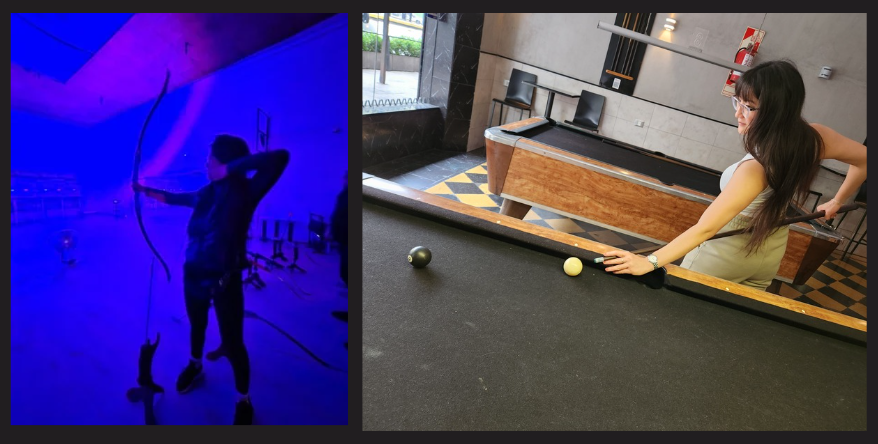

# 🚀 Bienvenidos a Mi README

### 📌 Información Personal
- **Nombre:** [Lucila Kim]
- **Legajo:** [222.435-5]
 

## 💁‍♀️​​ Sobre Mí
Vieron cuando se preguntan por que el **codigo funciona**? Bueno asi me siento en la facu. Fui quien puso Discretas como la fav. Me cuestan las cuentas simples. Si me preguntas cuanto es 8+17 no se. Pero te resuelvo ecuaciones diferenciales.

En la foto pareciera que juego bien al pool, PUES NO **soy MALISIMA**. Pero me las ingenio siempre para ganar varias partidas.

En cuanto a arqueria, lo practique durante unas vacaciones. Asisti a algun evento como el de la foto. Debo admitir que **soy bastante buena, tengo buena punteria. Fun fact,** al comienzo uno convive con unos moretones en el antebrazo que sostiene el arco, debido a que hay que colocar el brazo de una forma particularmente incomoda, y donde uno se descuida la soga latiga sobre el mismo.

Me considero una persona sociable y divertida. Disfruto mucho conocer gente nueva y aprender. Por lo que espero que tengamos una gran cursada del 2025❕​

En cuanto a mi objetivo profesional es trabajar de forma remota para una empresa internacional, comenzando como desarrolladora y creciendo dentro de ella. A medida que adquiera más experiencia, aspiro a asumir roles de mayor responsabilidad, con la posibilidad de llegar a ser CEO. También tengo en mente la posibilidad de iniciar una startup junto a socios, donde pueda aplicar mis habilidades técnicas y de liderazgo. Creo firmemente que no hay límites en lo que puedo lograr, y mi ambición es continuar aprendiendo y evolucionando, siempre en busca de nuevos desafíos y oportunidades.
